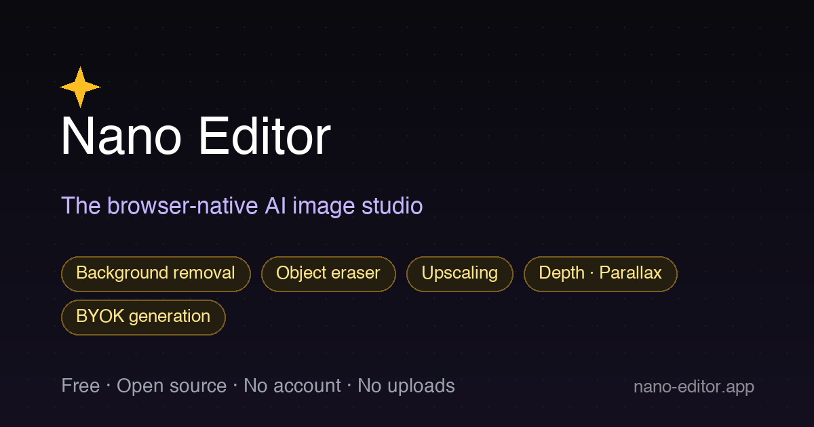
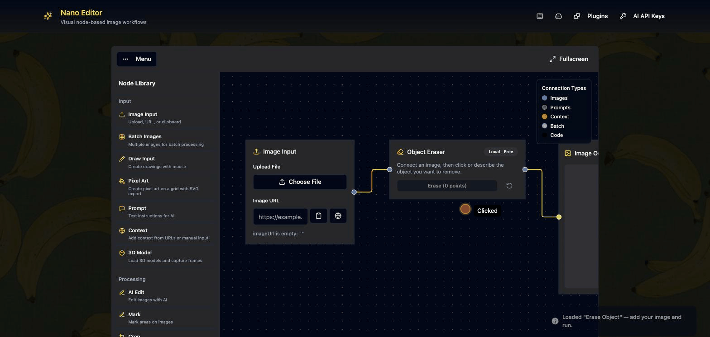

<p align="center">
  
</p>

<h1 align="center">Nano Editor</h1>

<p align="center">
  <strong>The design toolbox that lives in your browser.</strong><br>
  Generate, edit, cut out, erase, upscale, describe, animate — all the things you juggle across five different sites, on one free canvas.
</p>

<p align="center">
  <a href="https://nano-editor.app"><strong>▶ Try it live — nano-editor.app</strong></a> &nbsp;·&nbsp;
  100% in your browser &nbsp;·&nbsp; No account &nbsp;·&nbsp; No uploads &nbsp;·&nbsp; MIT
</p>

<p align="center">
  
</p>

---

Every day you bounce between a background remover on one site, an upscaler on another, a captioner somewhere else, and a generator behind a paywall. **Nano Editor puts all of it on one node canvas** — and most of it runs **free, locally, on your device** (WebGPU). Cloud generation is optional with your own API key. Your images never leave your machine for the local tools.

## What's inside

**Free · runs locally · nothing uploaded**

| Tool | What it does |
|---|---|
| 🪄 Background removal | RMBG / BEN2 / BiRefNet — export a transparent PNG |
| 🧽 Object eraser | Segment Anything + LaMa / MI-GAN inpainting — **click or describe** what to remove |
| 🔍 Upscaling | 2× / 4× super-resolution (Swin2SR) |
| 🏔️ Depth maps | Depth Anything V2 |
| 🎬 Depth → parallax video | Turn a still into a 2.5D animation; export MP4 / WebM / GIF |
| ✂️ Segmentation | Click or text-prompt to cut out objects (SlimSAM + OWLv2) |
| 📝 Captioning | Florence-2 / ViT-GPT2 — alt text or prompt seeds |
| 🎨 Effects | Halftone, pixelate, vectorize-to-SVG, and more |

**With your own fal.ai key (BYOK — pay the provider, no markup)**

Image generation & editing (Nano Banana / Nano Banana Pro), ESRGAN upscaling, and LLM-powered campaign / social-post / HTML-component generation.

## Why it's different

- **One place.** A visual node canvas chains tools instead of round-tripping between sites. Start from a template or build your own.
- **Private by design.** Local AI runs on-device via WebGPU — images never leave your browser. No account, ever.
- **Actually free.** No subscription, no watermark, no per-image cost for the local tools.
- **Open & extensible.** MIT-licensed. Add a community node from a plain JSON manifest, a sandboxed script, or **any Transformers.js-compatible Hugging Face model URL**. See [PLUGINS.md](PLUGINS.md).
- **Installable & offline.** It's a PWA — install it, and it works offline once models are cached.

## Run locally

```sh
npm install
npm run dev   # → http://localhost:8080
```

## Build

```sh
npm run build   # static output in dist/ — host anywhere, no env vars needed
```

## Tech

Vite · React · TypeScript · Tailwind + shadcn/ui · [@xyflow/react](https://reactflow.dev) (node canvas) · [Transformers.js](https://github.com/huggingface/transformers.js) + [onnxruntime-web](https://onnxruntime.ai/) on WebGPU · [Mediabunny](https://mediabunny.dev) / WebCodecs (video export) · [@fal-ai/client](https://fal.ai) (BYOK cloud) · idb-keyval

## Contributing

Issues and PRs welcome. The easiest way to add a capability is a plugin — a model node needs no code at all (just a manifest). See [PLUGINS.md](PLUGINS.md).

## License

MIT © Vortex303 and contributors. If Nano Editor is useful to you, consider [sponsoring its development](https://github.com/sponsors/vortex-303).
